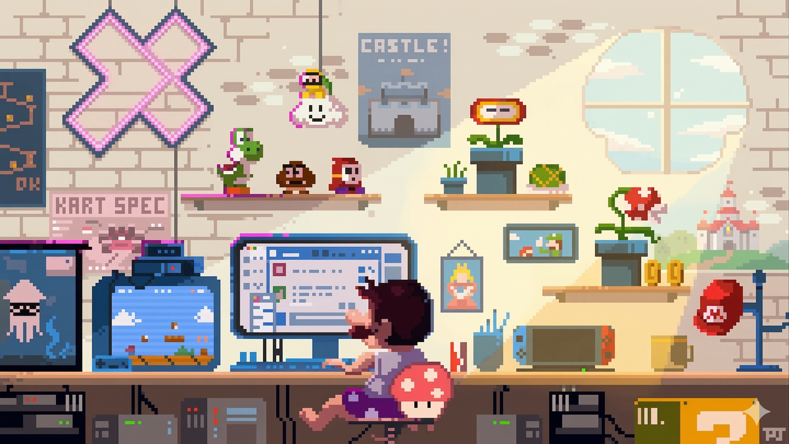

<h1 align="center"><b>Hi , I'm Mizab Ansari </b></h1>

<!-- Typewrite Effect -->

  <picture>
    
  </picture>

<!-- Banner -->

  <picture>
    <source media="(prefers-color-scheme: dark)" srcset="GIFs/hero.gif">
    
  </picture>

<!-- About me -->
## 🙋‍ **About me :**

- 👋 Greetings, I am Mizab, a Software Developer with a strong focus on delivering quality products and services. I believe in the importance of quality and excellence in my work. I always aim to innovate and improve, striving to meet and exceed expectations in the development field.

- 👀 I possess a wealth of knowledge and experience in a wide range of programming languages, including but not limited to JavaScript, TypeScript, Java, Python, React, NextJS, NodeJS, PHP, Sandstone, MCB, JMC, MongoDB, SQL, and ASM. My technical acumen and proficiency in these languages enable me to tackle complex projects and deliver innovative solutions.

- ⭐ When I am not busy developing games or apps, I enjoy playing games and experimenting with new technologies. I strive to keep up with the latest trends and emerging technologies to stay ahead of the curve in my field.

- 🌐 Overall, I am passionate about what I do, and I take great pride in delivering exceptional results. Thank you for taking the time to learn more about me, and I look forward to the opportunity to collaborate and create something amazing! 👨‍💻🚀🎉

- 🖥️  See my portfolio at [Portfolio Website](https://www.mizab.xyz/)

- ✉️  You can contact me at [mizab.developer.1@gmail.com](mailto:mizab.developer.1@gmail.com)

<!-- Flashing line -->
 

 

<!-- Tech stacks -->
## 🧑‍💻 **Technologies I use :**

  <a href="">
    <picture>
      <source media="(prefers-color-scheme: dark)" srcset="https://skillicons.dev/icons?i=ts%2Cjs%2Cpython%2Cjava%2Cphp%2Ctailwind%2Cbootstrap%2Cnodejs%2Creact%2Cnextjs%2Cexpress%2Cfastapi%2Cmysql%2Cmongodb%2Cdocker%2Ctensorflow%2Chtml%2Ccss&theme=dark&perline=6">
      <source media="(prefers-color-scheme: light)" srcset="https://skillicons.dev/icons?i=ts%2Cjs%2Cpython%2Cjava%2Cphp%2Ctailwind%2Cbootstrap%2Cnodejs%2Creact%2Cnextjs%2Cexpress%2Cfastapi%2Cmysql%2Cmongodb%2Cdocker%2Ctensorflow%2Chtml%2Ccss&theme=light&perline=6">
      
    </picture>
  </a>

## 💻 **Other Technologies I use :**

   
   
   
   

## 🔨 **Tools I use  :**

  <a href="">
    <picture>
      <source media="(prefers-color-scheme: dark)" srcset="https://skillicons.dev/icons?i=vscode%2Cgit%2Cgithub%2Cpowershell%2Cyarn%2Cnpm%2Cidea%2Cgcp%2Cbun%2Candroidstudio&theme=dark&perline=6">
      <source media="(prefers-color-scheme: light)" srcset="https://skillicons.dev/icons?i=vscode%2Cgit%2Cgithub%2Cpowershell%2Cyarn%2Cnpm%2Cidea%2Cgcp%2Cbun%2Candroidstudio&theme=light&perline=6">
      
    </picture>
  </a>
   

<!-- Stats  -->
## <b> Github Stats  :</b>
 

    <picture>
      <source media="(prefers-color-scheme: dark)" srcset="https://github-readme-stats.vercel.app/api?username=Mizab1&include_all_commits=true&count_private=true&show_icons=true&line_height=28&theme=tokyonight">
      
    </picture>
    <picture>
      <source media="(prefers-color-scheme: dark)" srcset="https://github-readme-stats.vercel.app/api/top-langs/?username=Mizab1&layout=compact&langs_count=10&theme=tokyonight">
      
    </picture>

 

    <picture>
      <source media="(prefers-color-scheme: dark)" srcset="https://streak-stats.demolab.com?user=Mizab1&theme=tokyonight">
      
    </picture>

<!-- Trophies (commented out because its broken from upstream) -->
<!-- ## 🏆 GitHub Trophies  :  -->
<!--  
  

    <picture>
      <source media="(prefers-color-scheme: dark)" srcset="https://github-profile-trophy.vercel.app/?username=Mizab1&theme=tokyonight&row=2">
      
    </picture>
  

  -->

<!-- Jokes and memes -->
## 😋 Fun?  : 

  <picture>
    <source media="(prefers-color-scheme: dark)" srcset="https://readme-jokes.vercel.app/api?theme=tokyonight">
    
  </picture>

<!-- Flashing line -->
 

 

<!-- Counter -->

